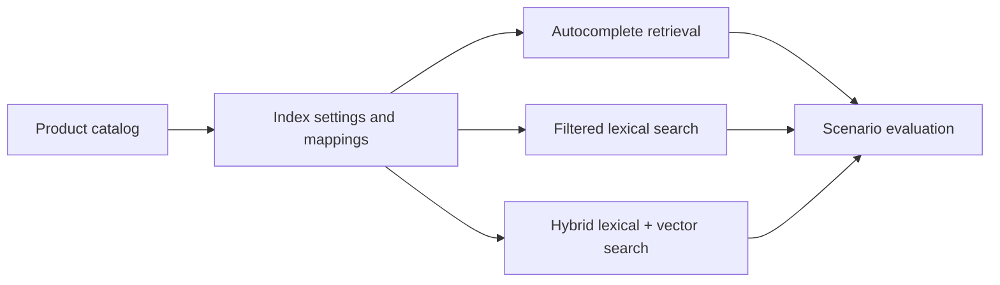

# product-discovery-elasticsearch

## Português

`product-discovery-elasticsearch` é um projeto de descoberta de produtos com foco em `Elasticsearch`. Ele foi desenhado para mostrar como estruturar uma camada de discovery moderna usando:

- `index settings`;
- `mappings`;
- analyzers e normalizers;
- autocomplete;
- filtros estruturados;
- recuperação híbrida lexical + vetorial.

O ponto central do projeto é mostrar que descoberta de produtos não depende só de “buscar texto”, mas de **desenhar o índice corretamente** para cada tipo de interação do usuário.

### Storytelling técnico

Em um catálogo real, o usuário não procura produtos sempre da mesma forma. Em alguns momentos, ele só começa a digitar o nome do item. Em outros, já sabe exatamente o que quer e precisa filtrar categoria ou faixa de preço. Em buscas mais ambíguas, o texto da consulta não coincide exatamente com o texto do catálogo, e aí a camada vetorial passa a ser útil.

Por isso, uma camada séria de product discovery normalmente precisa combinar:

- um **campo textual** para matching lexical;
- um **subcampo de autocomplete** para prefixos;
- **campos keyword** para filtros exatos;
- **campos numéricos** para preço e sinais operacionais;
- um **dense_vector** para semântica;
- uma lógica de combinação de sinais para ordenar melhor os resultados.

Este projeto implementa esse desenho em um benchmark pequeno, reproduzível e auditável.

### O que o projeto faz

O pipeline:

1. gera um catálogo sintético de produtos;
2. gera cenários de discovery com resposta esperada;
3. cria os arquivos de `settings` e `mappings` do índice;
4. registra exemplos de consulta para cada modo de busca;
5. executa três modos de discovery localmente;
6. mede se o item esperado ficou na primeira posição.

### Arquitetura do repositório

- [src/sample_data.py](/Users/flaviagaia/Documents/CV_FLAVIA_CODEX/product-discovery-elasticsearch/src/sample_data.py)  
  Gera o catálogo, os cenários, os settings, os mappings e os exemplos de consulta.
- [src/modeling.py](/Users/flaviagaia/Documents/CV_FLAVIA_CODEX/product-discovery-elasticsearch/src/modeling.py)  
  Implementa a lógica local de autocomplete, filtros e busca híbrida.
- [main.py](/Users/flaviagaia/Documents/CV_FLAVIA_CODEX/product-discovery-elasticsearch/main.py)  
  Executa o benchmark ponta a ponta.
- [tests/test_project.py](/Users/flaviagaia/Documents/CV_FLAVIA_CODEX/product-discovery-elasticsearch/tests/test_project.py)  
  Garante o contrato mínimo do projeto.
- [products_index_settings.json](/Users/flaviagaia/Documents/CV_FLAVIA_CODEX/product-discovery-elasticsearch/index_configs/products_index_settings.json)  
  Define tokenizer, analyzers e normalizer.
- [products_index_mappings.json](/Users/flaviagaia/Documents/CV_FLAVIA_CODEX/product-discovery-elasticsearch/index_configs/products_index_mappings.json)  
  Define tipos, subcampos e `dense_vector`.
- [query_examples.json](/Users/flaviagaia/Documents/CV_FLAVIA_CODEX/product-discovery-elasticsearch/search_examples/query_examples.json)  
  Traz exemplos de consulta alinhados ao índice.

### Pipeline conceitual

## Settings do índice

Arquivo:

- [products_index_settings.json](/Users/flaviagaia/Documents/CV_FLAVIA_CODEX/product-discovery-elasticsearch/index_configs/products_index_settings.json)

### O que ele define

#### `autocomplete_tokenizer`

Tokenizer `edge_ngram` usado para gerar prefixos de termos.

Função:

- viabilizar autocomplete;
- recuperar resultados mesmo quando a busca ainda está incompleta.

Exemplo conceitual:

- `sony` pode gerar tokens como `so`, `son`, `sony`.

#### `product_text_analyzer`

Analyzer principal dos campos textuais.

Função:

- tokenizar o texto normalmente;
- aplicar `lowercase`;
- aplicar `asciifolding`.

Isso ajuda a manter o matching textual mais consistente.

#### `autocomplete_analyzer`

Analyzer específico para o subcampo de autocomplete.

Função:

- usar o tokenizer de prefixo;
- permitir recuperação incremental conforme o usuário digita.

#### `lowercase_normalizer`

Normalizador usado em campos `keyword`.

Função:

- garantir que filtros por `brand` ou `category` não dependam da capitalização original.

## Mappings do índice

Arquivo:

- [products_index_mappings.json](/Users/flaviagaia/Documents/CV_FLAVIA_CODEX/product-discovery-elasticsearch/index_configs/products_index_mappings.json)

### Campos principais e seu papel

#### `sku`

Tipo: `keyword`

Uso:

- identificação exata do produto;
- joins lógicos com sistemas externos;
- referência operacional.

#### `title`

Tipo: `text`

Uso:

- principal campo de matching textual.

Subcampos:

- `title.autocomplete`
  usado para descoberta por prefixo;
- `title.raw`
  usado quando se quer valor exato do título como `keyword`.

#### `description`

Tipo: `text`

Uso:

- ampliar cobertura lexical além do título;
- enriquecer a busca com mais contexto semântico.

#### `brand`

Tipo: `keyword`

Uso:

- filtro exato;
- boosts de marca;
- facets e agregações.

#### `category`

Tipo: `keyword`

Uso:

- filtro de vertical;
- agregações por categoria;
- narrowing da busca.

#### `price`

Tipo: `scaled_float`

Uso:

- filtros por faixa de preço;
- ordenação;
- estabilidade numérica melhor do que `float` simples em alguns casos.

#### `rating`

Tipo: `float`

Uso:

- sinal de qualidade percebida;
- possível boost de ranking em evolução futura.

#### `popularity_score`

Tipo: `float`

Uso:

- refletir tração histórica;
- aproximar comportamento de catálogo real.

#### `inventory_score`

Tipo: `float`

Uso:

- sinalizar disponibilidade operacional;
- evitar promover alto um item com baixa viabilidade.

#### `is_promoted`

Tipo: `boolean`

Uso:

- controlar destaque promocional;
- ativar regras simples de negócio.

#### `embedding`

Tipo: `dense_vector`

Uso:

- suportar recuperação vetorial;
- aproximar busca por intenção semântica.

## Por que esse desenho de índice é bom

Esse índice separa bem os tipos de problema:

- texto livre para busca;
- prefixo para autocomplete;
- chave exata para filtros;
- números para filtros e sinais;
- vetor para semântica.

Essa separação é exatamente o que faz um índice de discovery escalar melhor conceitualmente.

## Dataset local

Arquivos:

- [product_catalog.csv](/Users/flaviagaia/Documents/CV_FLAVIA_CODEX/product-discovery-elasticsearch/data/raw/product_catalog.csv)
- [search_scenarios.csv](/Users/flaviagaia/Documents/CV_FLAVIA_CODEX/product-discovery-elasticsearch/data/raw/search_scenarios.csv)

### Estrutura do catálogo

Cada produto contém:

- `sku`
- `title`
- `description`
- `brand`
- `category`
- `price`
- `rating`
- `popularity_score`
- `inventory_score`
- `is_promoted`

### Estrutura dos cenários

Cada cenário contém:

- `scenario_id`
- `query_text`
- `search_mode`
- `category_filter`
- `price_range`
- `expected_sku`

Esses cenários representam comportamentos típicos de discovery:

- autocomplete;
- busca textual com filtros;
- busca híbrida.

## Técnicas utilizadas no benchmark

### 1. Busca lexical

O projeto usa `TF-IDF + cosine similarity` como aproximação leve da camada lexical.

Papel:

- simular matching textual;
- dar suporte à busca filtrada;
- contribuir para a camada híbrida.

### 2. Autocomplete

O benchmark implementa um `prefix score` local.

Papel:

- simular o efeito do subcampo `title.autocomplete`;
- refletir o comportamento de consultas incompletas.

### 3. Busca vetorial

O benchmark cria embeddings densos com:

- `TF-IDF`
- seguido por `TruncatedSVD`

Depois calcula similaridade vetorial por cosseno.

Papel:

- simular a existência do campo `dense_vector`;
- representar um segundo canal de relevância.

### 4. Filtros estruturados

O benchmark usa:

- `category_filter`
- `price_range`

Papel:

- representar filtros sobre `keyword` e `scaled_float`;
- aproximar a experiência real de navegação.

### 5. Fusão de sinais

Dependendo do modo de busca, o pipeline combina:

- `autocomplete_component`
- `lexical_component`
- `semantic_component`
- `popularity_component`
- `inventory_component`
- `promoted_component`

Isso mostra que o ranking final não nasce de um único score.

## Modos de discovery simulados

### `autocomplete`

Objetivo:

- favorecer prefixos;
- devolver resultado útil cedo.

Exemplo:

- query: `sony head`

### `filtered_search`

Objetivo:

- recuperar itens lexicalmente relevantes dentro de um recorte estruturado.

Exemplo:

- query: `wireless keyboard`
- filtro: `computer_accessories`

### `hybrid_search`

Objetivo:

- combinar matching lexical e matching vetorial em buscas menos literais.

Exemplo:

- query: `running gps watch`

## Exemplos de consulta

Arquivo:

- [query_examples.json](/Users/flaviagaia/Documents/CV_FLAVIA_CODEX/product-discovery-elasticsearch/search_examples/query_examples.json)

### O que ele mostra

#### Exemplo de autocomplete

Usa `multi_match` em:

- `title.autocomplete`
- `title`
- `brand`

Mostra como o subcampo de autocomplete convive com o campo textual principal.

#### Exemplo de busca filtrada

Usa:

- `match` para texto;
- `term` para filtro de categoria.

Mostra a convivência entre texto livre e filtros estruturados.

#### Exemplo de busca híbrida

Usa uma estrutura conceitual com:

- `standard` retriever;
- `knn`;
- `rrf`.

Mostra como o índice foi preparado para um cenário moderno de discovery semântico.

## Métrica de avaliação

A métrica principal do benchmark é `success_rate_at_1`.

Pergunta:

- o SKU esperado ficou em primeiro lugar?

Essa métrica faz sentido aqui porque o projeto mede cenários de discovery orientados ao topo do ranking.

## Resultados atuais

- `dataset_source = product_discovery_elasticsearch_sample`
- `product_count = 8`
- `scenario_count = 4`
- `success_rate_at_1 = 1.0`

### Interpretação dos resultados

O benchmark atual mostrou acerto de topo em todos os cenários simulados.

Isso deve ser lido como:

- validação da modelagem do índice;
- validação da coerência entre settings, mappings e query examples;
- validação da separação entre modos de discovery.

Como a base ainda é pequena e sintética, isso não representa um cenário de produção, mas mostra bem a arquitetura.

## Artefatos gerados

- [product_discovery_results.csv](/Users/flaviagaia/Documents/CV_FLAVIA_CODEX/product-discovery-elasticsearch/data/processed/product_discovery_results.csv)
- [product_discovery_report.json](/Users/flaviagaia/Documents/CV_FLAVIA_CODEX/product-discovery-elasticsearch/data/processed/product_discovery_report.json)
- [products_index_settings.json](/Users/flaviagaia/Documents/CV_FLAVIA_CODEX/product-discovery-elasticsearch/index_configs/products_index_settings.json)
- [products_index_mappings.json](/Users/flaviagaia/Documents/CV_FLAVIA_CODEX/product-discovery-elasticsearch/index_configs/products_index_mappings.json)
- [query_examples.json](/Users/flaviagaia/Documents/CV_FLAVIA_CODEX/product-discovery-elasticsearch/search_examples/query_examples.json)

## Limitações atuais

- o projeto não sobe um cluster Elasticsearch real;
- a camada vetorial local é uma aproximação reproduzível;
- o catálogo ainda é pequeno;
- o benchmark cobre poucos cenários.

## Próximos passos naturais

- conectar a um cluster Elasticsearch real;
- usar `kNN` real sobre `dense_vector`;
- ampliar o benchmark de cenários;
- adicionar agregações e facets;
- testar reranking supervisionado;
- medir `MRR` e `NDCG`.

## English

`product-discovery-elasticsearch` is a product discovery project focused on Elasticsearch. It shows how to structure:

- index settings;
- mappings;
- analyzers and normalizers;
- autocomplete;
- filtered search;
- hybrid lexical plus vector retrieval.

### Current Results

- `dataset_source = product_discovery_elasticsearch_sample`
- `product_count = 8`
- `scenario_count = 4`
- `success_rate_at_1 = 1.0`
