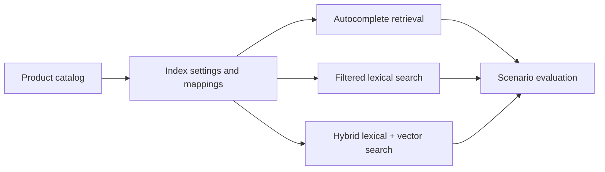

# product-discovery-elasticsearch

## Português

`product-discovery-elasticsearch` é um projeto de descoberta de produtos com foco em `Elasticsearch`. Ele foi estruturado para mostrar, de forma explícita, como modelar um índice de catálogo e como combinar diferentes modos de busca em uma experiência de discovery:

- autocomplete;
- busca lexical com filtros;
- busca híbrida lexical + vetorial.

### Storytelling técnico

Em descoberta de produtos, o usuário quase nunca interage com a busca de um único jeito. Em alguns momentos ele digita só o começo do nome do item. Em outros, faz uma busca mais direta e filtra categoria ou faixa de preço. Em cenários mais ambíguos, a intenção da busca não coincide exatamente com o texto do catálogo e a recuperação vetorial passa a fazer sentido.

É por isso que uma camada de product discovery real costuma depender de:

- **settings de índice bem pensados**;
- **mappings adequados para cada tipo de campo**;
- **analyzers e normalizers**;
- **autocomplete**;
- **filtros estruturados**;
- **dense_vector** para busca semântica;
- **fusão de sinais** para ordenar melhor os resultados.

Este projeto demonstra essa arquitetura em um benchmark pequeno, reproduzível e auditável.

### O que o projeto faz

O pipeline:

1. gera um catálogo sintético de produtos;
2. gera cenários de busca com expectativa conhecida;
3. produz `index settings` e `mappings`;
4. registra exemplos de query para diferentes modos de busca;
5. executa três modos de discovery localmente;
6. mede se o item esperado ficou na primeira posição.

### Arquitetura do repositório

- [src/sample_data.py](/Users/flaviagaia/Documents/CV_FLAVIA_CODEX/product-discovery-elasticsearch/src/sample_data.py)  
  Gera os dados brutos, os settings, os mappings e os exemplos de consulta.
- [src/modeling.py](/Users/flaviagaia/Documents/CV_FLAVIA_CODEX/product-discovery-elasticsearch/src/modeling.py)  
  Implementa a lógica de autocomplete, filtros e busca híbrida.
- [main.py](/Users/flaviagaia/Documents/CV_FLAVIA_CODEX/product-discovery-elasticsearch/main.py)  
  Executa o benchmark ponta a ponta.
- [tests/test_project.py](/Users/flaviagaia/Documents/CV_FLAVIA_CODEX/product-discovery-elasticsearch/tests/test_project.py)  
  Verifica o contrato mínimo do projeto.
- [products_index_settings.json](/Users/flaviagaia/Documents/CV_FLAVIA_CODEX/product-discovery-elasticsearch/index_configs/products_index_settings.json)  
  Define tokenizer, analyzer e normalizer do índice.
- [products_index_mappings.json](/Users/flaviagaia/Documents/CV_FLAVIA_CODEX/product-discovery-elasticsearch/index_configs/products_index_mappings.json)  
  Define os tipos dos campos do catálogo.
- [query_examples.json](/Users/flaviagaia/Documents/CV_FLAVIA_CODEX/product-discovery-elasticsearch/search_examples/query_examples.json)  
  Traz exemplos de query para autocomplete, busca filtrada e busca híbrida.

### Pipeline conceitual

## Índice e mappings

### Settings do índice

Arquivo:

- [products_index_settings.json](/Users/flaviagaia/Documents/CV_FLAVIA_CODEX/product-discovery-elasticsearch/index_configs/products_index_settings.json)

O índice define:

- `autocomplete_tokenizer`
  do tipo `edge_ngram`, para suportar prefixos;
- `product_text_analyzer`
  para os campos textuais principais;
- `autocomplete_analyzer`
  para o subcampo de autocomplete;
- `lowercase_normalizer`
  para campos `keyword`.

### O que cada configuração faz

#### `edge_ngram`

Serve para autocomplete por prefixo. Em vez de esperar a palavra completa, o índice já prepara fragmentos do início do termo.

Exemplo conceitual:

- `sony` pode gerar prefixos como `so`, `son`, `sony`

Isso ajuda quando o usuário digita apenas o começo da busca.

#### `product_text_analyzer`

É o analyzer principal de texto. Ele:

- tokeniza o conteúdo;
- converte para minúsculas;
- remove variações simples de acentuação.

#### `autocomplete_analyzer`

É o analyzer especializado para o subcampo de autocomplete. Ele é separado do analyzer principal porque o objetivo aqui é recuperar prefixos, não apenas texto completo.

#### `lowercase_normalizer`

É usado em campos `keyword` como `brand` e `category`, para que filtros exatos não falhem por diferença de caixa.

### Mappings do índice

Arquivo:

- [products_index_mappings.json](/Users/flaviagaia/Documents/CV_FLAVIA_CODEX/product-discovery-elasticsearch/index_configs/products_index_mappings.json)

Campos principais:

- `sku`
  `keyword` para identificação exata.
- `title`
  `text` com analyzer principal e subcampos:
  - `title.autocomplete`
  - `title.raw`
- `description`
  `text` para recuperação textual.
- `brand`
  `keyword` com normalizer.
- `category`
  `keyword` com normalizer.
- `price`
  `scaled_float` para filtros e ordenação.
- `rating`
  `float` como sinal de qualidade percebida.
- `popularity_score`
  `float` como sinal de tração.
- `inventory_score`
  `float` como sinal operacional.
- `is_promoted`
  `boolean` para promoções controladas.
- `embedding`
  `dense_vector` com `dims = 5` e `similarity = cosine`.

### Por que esse mapping faz sentido

Ele separa claramente:

- campos de **texto livre**;
- campos de **filtro exato**;
- campos **numéricos** para ranking e filtros;
- campo vetorial para **semântica**;
- subcampo dedicado a **autocomplete**.

Esse é exatamente o tipo de modelagem esperado em uma camada séria de discovery.

## Dataset local

Arquivos:

- [product_catalog.csv](/Users/flaviagaia/Documents/CV_FLAVIA_CODEX/product-discovery-elasticsearch/data/raw/product_catalog.csv)
- [search_scenarios.csv](/Users/flaviagaia/Documents/CV_FLAVIA_CODEX/product-discovery-elasticsearch/data/raw/search_scenarios.csv)

### Estrutura do catálogo

Cada produto contém:

- `sku`
- `title`
- `description`
- `brand`
- `category`
- `price`
- `rating`
- `popularity_score`
- `inventory_score`
- `is_promoted`

### Estrutura dos cenários

Cada cenário contém:

- `scenario_id`
- `query_text`
- `search_mode`
- `category_filter`
- `price_range`
- `expected_sku`

Isso permite simular diferentes comportamentos do usuário em uma mesma camada de busca.

## Técnicas utilizadas

### 1. Busca lexical

O projeto usa `TF-IDF + cosine similarity` como aproximação leve da camada lexical.

Papel:

- simular recuperação textual;
- dar suporte à busca filtrada;
- contribuir para a camada híbrida.

### 2. Autocomplete

O projeto implementa um score local de prefixo para simular o efeito do campo `title.autocomplete`.

Papel:

- suportar consultas incompletas;
- aproximar o comportamento esperado de um autocomplete de catálogo.

### 3. Busca vetorial

O projeto cria embeddings densos locais com:

- `TF-IDF`
- seguido por `TruncatedSVD`

Depois calcula similaridade vetorial com cosseno.

Papel:

- simular a presença do campo `dense_vector`;
- representar uma camada semântica leve e reproduzível.

### 4. Filtros estruturados

O benchmark suporta:

- filtro de categoria;
- filtro de faixa de preço.

Isso representa o comportamento clássico de filtros sobre campos `keyword` e `scaled_float`.

### 5. Fusão de sinais

Dependendo do modo de busca, o pipeline combina:

- `autocomplete_component`
- `lexical_component`
- `semantic_component`
- `popularity_component`
- `inventory_component`
- `promoted_component`

Ou seja, o discovery não depende de um único canal.

## Modos de busca simulados

### `autocomplete`

Objetivo:

- favorecer prefixos e matching rápido de intenção curta.

Exemplo:

- query: `sony head`

### `filtered_search`

Objetivo:

- recuperar resultados textualmente relevantes dentro de uma categoria ou faixa de preço.

Exemplo:

- query: `wireless keyboard`
- filtro: `computer_accessories`

### `hybrid_search`

Objetivo:

- combinar texto e vetor quando a intenção da busca não depende só de coincidência literal.

Exemplo:

- query: `running gps watch`

## Exemplos de queries

Arquivo:

- [query_examples.json](/Users/flaviagaia/Documents/CV_FLAVIA_CODEX/product-discovery-elasticsearch/search_examples/query_examples.json)

Ele inclui:

- exemplo de `multi_match` para autocomplete;
- exemplo de `bool + filter` para busca filtrada;
- exemplo conceitual de `retrievers` com `RRF` para busca híbrida.

## Métrica de avaliação

A métrica principal do projeto é `success_rate_at_1`.

Ela responde:

- o SKU esperado ficou em primeiro lugar no cenário avaliado?

É uma métrica simples, mas adequada para um benchmark de discovery com cenários de topo do ranking.

## Resultados atuais

- `dataset_source = product_discovery_elasticsearch_sample`
- `product_count = 8`
- `scenario_count = 4`
- `success_rate_at_1 = 1.0`

### Interpretação dos resultados

O benchmark atual mostrou acerto de topo em todos os cenários simulados.

Isso deve ser lido como:

- validação estrutural do projeto;
- demonstração de que settings, mappings e modos de busca estão coerentes;
- e não como estimativa de produção, já que a base ainda é pequena e sintética.

## Artefatos gerados

- [product_discovery_results.csv](/Users/flaviagaia/Documents/CV_FLAVIA_CODEX/product-discovery-elasticsearch/data/processed/product_discovery_results.csv)
- [product_discovery_report.json](/Users/flaviagaia/Documents/CV_FLAVIA_CODEX/product-discovery-elasticsearch/data/processed/product_discovery_report.json)
- [products_index_settings.json](/Users/flaviagaia/Documents/CV_FLAVIA_CODEX/product-discovery-elasticsearch/index_configs/products_index_settings.json)
- [products_index_mappings.json](/Users/flaviagaia/Documents/CV_FLAVIA_CODEX/product-discovery-elasticsearch/index_configs/products_index_mappings.json)
- [query_examples.json](/Users/flaviagaia/Documents/CV_FLAVIA_CODEX/product-discovery-elasticsearch/search_examples/query_examples.json)

## Limitações atuais

- o projeto não sobe um cluster Elasticsearch real;
- a camada vetorial local é uma aproximação reproduzível;
- a base de catálogo ainda é pequena;
- o benchmark cobre poucos cenários.

## Próximos passos naturais

- plugar o índice em um Elasticsearch real;
- adicionar `kNN` real no campo `dense_vector`;
- ampliar o benchmark de queries;
- incluir agregações e facets;
- testar reranking supervisionado;
- medir `MRR` e `NDCG`.

## English

`product-discovery-elasticsearch` is a product discovery project focused on Elasticsearch. It explicitly demonstrates:

- index settings;
- mappings for product catalogs;
- autocomplete;
- filtered search;
- hybrid lexical plus vector retrieval.

### Current Results

- `dataset_source = product_discovery_elasticsearch_sample`
- `product_count = 8`
- `scenario_count = 4`
- `success_rate_at_1 = 1.0`
